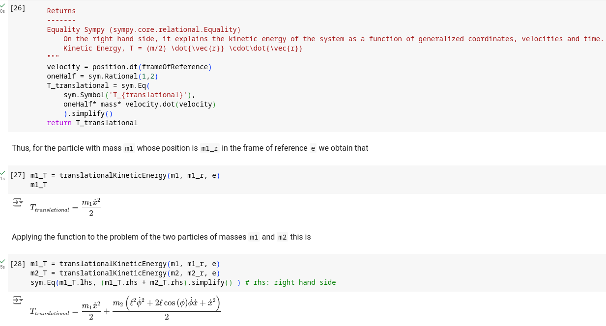

<!--  Notas sobre modificaciones y cambios realizados
1. single-degree, single degree: ver nota de estilo de PR. También libro Fasano. Lo usaría como "single degree".
2. "constraint forces", en Fasano, et al aparece como "constraint reaction" y luego lo llaman fuerza (p. 77)
-->

# Summary

We present a code-based undergraduate course on analytical mechanics for engineering students with little to no prior programming knowledge.
This 16-week flipped classroom course provides skills to calculate dynamics and strains of simple mechanical devices modelled as rigid bodies by solving Euler-Lagrange equations.
Each example and practice exercise are solved using computer-based analytical and numerical calculations with the aim to deflect students' focus of attention away from repetitive mathematical tasks towards the physics modelling.

The course addresses specific regional issues of third-year Latin American students (mid-career), that by then have learned how to solve ordinary differential equations. 
Theory and examples exercises alongside the _Python_ code that solves them are presented in _Jupyter notebooks_, that are run online to avoid installation and hardware requirement issues.
Currently, the material is available in a GitHub repository in Spanish and has only been partially translated into English.
<!--
It is free to use and modify under a Creative Commons licence (CC BY-NC-SA 4.0) for the community is encouraged to contribute to its translation and improvement.
-->

## Statement of need
Latin American public universities face two simultaneous constrains: tight budgets and the need to accommodate their classes' schedules to day-working students [@vallejoGoogle:2022].
These cash-stripped universities seldom avail computing resources for courses that are not directly related to computer science or programming. 
Also, as undergraduate programs on engineering at Latin American universities are usually longer than the three-years bachelors at their Anglo-Saxon counterparts, it is quite common that students are already inserted into the labour market while studying, so they have a tight schedule and are not able to attend to the university during daytime hours. 
<!--
Ojalá fuera cierto. Sinceramiento: ni saben que existen las alternativas de software libre. Authorities of these cash-stripped universities often ask that any solution to introduce students to coding skills should be based upon open-source fee-free resources.
-->

<!--
It is worth mentioning that this course is tought at University of La Matanza (UNLaM), located at the outskirts of Buenos Aires that attracts working students who have a day job and take classes courses mostly at night shifts.
-->

<!--
There are deep differences between engineering syllabus to the ones at anglo-saxon counterparts, as undergraduate engineering courses are usually six-years long.
-->
<!--
UNAM, México, 10 semestres
https://www.ingenieria.unam.mx/programas_academicos/licenciatura/mecanica_plan2023.php
-->
<!--
Unicamp, Brasil, 10 semestres
https://www.dac.unicamp.br/sistemas/catalogos/grad/catalogo2023/cursos/10g/sugestao.html
-->

The course presented addresses those issues by providing a free, online, and asynchronous learning environment that allows students to study at their own pace through the flipped classroom approach.
In advance to weekly meetings, students are required to study the theory and examples provided in the notebooks, as well as to initiate solving the accompanying exercises.
During those evening meetings, either online or in presence, students are encouraged to ask questions and discuss the problems they could not solve with the teaching staff.

## Basis for the syllabus
Traditionally, systems dealt with at analytical mechanics courses are as simple as possible in order to limit the extent of the mathematical work required. 
So, realistic machine parts modelling is seldom undertaken as that would lead to a level of complexity sometimes untenable by students and teaching staff working on the blackboard or paper.
This course aims to avoid this pitfall by taking advantage of the relative simple syntax of modern programming languages for tackling mathematical problems.
This allows to rapidly introduce the students to life-like problems avoiding oversimplifications.
<!--
Such over-simplification leads to a complexity jump at the time more realistic systems are needed to be dealt at later courses of the mechanical engineering curricula. 

Yet knowledge and practice not only on numerical analysis, but also on programming as a tool, were seldom exploited at UNLaM to address this issue. 
-->

Each task for the mechanical system modelling, as well as the algebraic or calculus operations, required to generate the Euler-Lagrange differential equations are done using the _Python_ programming language.

A sub-package of the _SymPy_ library, _physics.mechanics_, is the main tool used.
It is a port of the [_PyDy_ library](https://www.pydy.org/history.html), which was developed to provide a symbolic mechanics environment for _Python_ as a replacement of the commercial [_Autolev_ software](https://link.springer.com/chapter/10.1007/978-3-642-50995-7_7) that instrumentalised [Kane's method](https://ecommons.cornell.edu/items/1f0e5629-0caa-4be2-8384-8869eb9e4fac) to derive equations of motion at [UC Davis Multibody Dynamics course](https://moorepants.github.io/mae223/).

Courses, such as TU Delft's [Multibody Dynamics](https://moorepants.github.io/me41055/), itself a successor of the [UC's course](https://moorepants.github.io/mae223/) of the same name, had for years been applying this library with a similar objective.
As stated the on-line book on which the course is based, [Learn Multibody Dynamics](https://moorepants.github.io/learn-multibody-dynamics/introduction.html#choice-of-dynamics-formalism), the author chooses to derive equations of motion with the [Kane's method](https://ecommons.cornell.edu/items/1f0e5629-0caa-4be2-8384-8869eb9e4fac) in order to avoid introducing virtual motion concepts and the need of Lagrange multipliers to handle constrains.
Kane in the preface of his book states that by focusing on motions instead of the physical configuration of the system, his method maximises physical insight.

The course presented here, however, 

Although the SymPy _physics.mechanics_ module provides functionality for deriving equations of motion using [Lagrange’s method](https://docs.sympy.org/latest/modules/physics/mechanics/lagrange.html), this course aims for the student to follow the standard mathematical notation and procedures to produce them in the same way they would have done on paper.
The idea is to make the student can verify each step of the process and only later rely on functions that made around these steps avoiding any _black box_ unbeknown to them.

We want to emphasise that the course is not about teaching programming, nor about high-performance modelling of mechanical systems.
The aim of employing the computer is to free-up students from the repetitive nature of the calculations, so they can focus on the physical aspects of the problems.
The deliberate decision that everything get solved by code, even the earliest examples, aims to reinforce the advice given to students to avoid solving the initial problem sets on paper. 
Some students did so at earlier editions of the course did so only to got stuck while solving later more complex problems without the computer help.
By slight modifications over the Python code presented by the teaching staff, students build their own library of solutions to address mechanical modelling challenges.
Once the students generate the Euler-Lagrange equations, their numerical solutions are obtained using the _Scipy_ library [@sciPyNMeth:2020], and plotted using _Matplotlib_[@HunterMatplotlib:2007] to better understand the physical implications of the solutions.
<!--
¿Se incluyen referencias a bibliotecas? ¿Hacen eso en artículos de JOSE?
-->

<!--
The course uses a general purpose programming language, Python, instead of a more specialized to mathematics ones, such as Octave or Scilab, was made to allow the students to integrate the skills acquired in this course to later subjects of the mechanical engineering curriculum.
All algebraic or calculus operations required to generate the Euler-Lagrange differential equations are done using the Python library Sympy.
Their numerical solutions are obtained using Scipy, and the plotting of results is done using Matplotlib.
-->
<!--
Integrar lo siguiente, tal vez no sea buena idea. No se si aporta algo.
As illustrated by , anytime a repetitive task is identified, it is presented to students as a good candidate to be automated by a function.
-->

## Overview, Content, and Structure
<!--
Repository
-->
Full course material is available in a GitHub repository [in Spanish](https://github.com/bettachini/MecanicaAnaliticaComputacional), with an ongoing [translation to English](https://github.com/unlam/ComputationalAnalyticalMechanics).
The first twelve folders contain the course material, each one corresponding to a unit:
1. Course methodology, Newtonian physics and Sympy introduction.
2. Degrees of freedom, generalized coordinates and energy.
3. Euler-Lagrange mechanics, Euler-Lagrange equations.
4. Constraints as a function of coordinates.
5. Numerical solving of Euler-Lagrange equations.
6. Constraint reactions and Lagrange multipliers.
7. Non-conservative forces in the Euler-Lagrange framework.
8. Rigid-body and inertia tensor.
9. Rigid-body, Euler equations.
10. Oscillations in single degree of freedom (SDoF) systems, forced oscillations and discrete systems.
11. Oscillations multiple degrees of freedom (MDoF) systems. Normal modes of discrete systems.

<!--
Also, accompanied by a set of examples, including functions to be modified by the students and incorporated as new tools to solve
-->
Each folder contains Jupyter notebooks with the required theory for the unit subject alongside the code that solves example exercises.
The students only need to modify that code to solve the exercises proposed at the accompanying problem sets.
These are provided in PDF format alongside their LaTeX source and figure files allowing their customisation.
The number of exercises in each problem set, while still being illustrative of the variety of the unit subject applications, is kept small in order to make their solving mandatory on a weekly basis.
Those of units 8, 9 and 11 are exceptions, requiring two weeks each, as they deal with subjects that had shown to be somewhat more demanding to students.

Two further weeks complete a 16-week schedule.
These are reserved not only for the students to submit overdue exercises but, mainly, to perform an oral presentation on how they solved a final project.  
Its aim is to calculate torques and forces that the motors of a simplified factory robotic arm should apply to make it perform a sequence of movements.
As it requires the student to master the skills acquired during the first nine units, its statement is presented at the second week for that unit.
This arrangement gives enough time for the students to consult on its difficulties and prepare the presentation.
The oral examination is intended to gauge the students' learning, not only on the physics and computational skill required to solve this kind of problems, but also on how to provide a well planned oral presentation.

## Implementation
The _Google Colaboratory_ service allows students to read and execute Jupyter notebooks, as it currently demands no payment and can be accessed from any internet browser.
At _UNLaM_, the university where the course is taught, _SageMaker StudioLab_, _GitHub Codespaces_, _Cocalc_ or indeed _Kaggle_ had also been tested for this purpose but _Colab_, as is commonly known, is currently used as it provides a useful feature for students to pose questions by the way of side-notes to each cell of the notebooks.
Teaching staff can con reply them individually, and students can re-reply thus providing an asynchronous interaction channel in between the weekly synchronic meetings.

Students are required to submit their solution to the complete course's problem sets.
_MS Teams_ is used to assign and keep track of student's work, but any LMS, such as the open source _Moodle_, can fulfil this task.
Teaching staff check the submissions and, if required, returns them with comments to correct them.
This way, students are encouraged to solve all exercises, as they are mandatory to pass the course, and to ask for help when they are stuck.

## Conclusions
The mechanical engineering programme is relatively new at UNLaM, so the number of students per class is still low, around eight, thus still allowing this personalised tracking of student's progress.
Larger audiences will provide a challenge, probably requiring to include new teaching assistants as well as introducing automatic grading, to somewhat stick to this methodology.
<!--
## Balance of the methodology
This course differs from conventional ones by being:
- Code-based:
  1. Avoids the repetitive nature of blackboard or paper based calculations. 
  1. By iteratively modifying previously tested code (initially designed for simpler mechanical systems), students expand their analytical capabilities.
  1. The complexity of the code evolves alongside the mechanical system’s intricacies introduced each class.
  1. This approach eliminates the need to _start from scratch_ when dealing with the extensive calculations required for analyzing complex mechanical systems using the Euler-Lagrange formalism.
  1. All systems used are currently available online on a non-cost basis, from the student point of view. Being based on free software, if any of them is later placed behind a paywall, it would be simple to run them from on the premise servers.
- Following a flipped classroom approach
  1. Students are provided with online theory and example problems to study before weekly meetings. These asynchronous activities save classroom time for discussions and problem-solving.
  1. During synchronic meetings they can rise to teachers any questions related to theory or problem-solving, so they can finish their exercise sets.
  1. All exercises are turned-in for evaluation. Compliance is tracked with an online learning management system. 
-->    
<!--
This course stands out from conventional approaches in Latin American courses by adopting a code-based methodology.
Rather than relying solely on repetitive blackboard or paper-based calculations, students engage the problems with code.
By iteratively modifying and experimenting with example code the students gradually expand their analytical capabilities, so focusing on the physical aspects and not on the mathematical aspect of the problems.
This also provides the advantage to increase the complexity of the problems, since numerical approaches can easily be applied by modifying teacher's code.

As the mechanical systems discussed in class become more intricate, so does the complexity of the code.
Yet, the students are not required to _start from scratch_ when dealing with the extensive calculations required for analysing complex mechanical systems using the Euler-Lagrange formalism.

Another important point is that all the systems used are currently available online at no cost to students, and since they are based on free software, any potential paywalls won’t hinder access; students can always run the systems on local servers.

As discussed previously, the presented course follows a flipped-classroom approach.
Students receive online theory materials and example problems to study in anticipation to weekly meetings.
Asynchronous personal consultations on exercises free-up valuable classroom time for collaborative problem-solving and discussions on difficult concepts of theory.

In summary, this course combines code-based exploration with a flipped classroom model, empowering students into complex mechanical systems while optimizing their learning experience
-->
For the time being, feedback from students consistently indicates a high level of satisfaction with this course, especially with its code-driven aspect.
Additionally, students express interest in the final examination as it provides an opportunity to apply both their presentation skills and the knowledge acquired throughout the course.
In relation to the flipped classroom model, students acknowledge that it requires a grater effort, but a majority of them agree that it is a positive and beneficial implementation.
This is in line with previous research on the flipped classroom model for advances mechanical engineering courses [@mason_comparing_2013].

The authors are confident that the methodology employed in this course offers greater practical utility to students in subsequent subjects and their professional lives, surpassing the benefits of a traditional course.

<!--
Citations to entries in paper.bib should be in
[rMarkdown](http://rmarkdown.rstudio.com/authoring_bibliographies_and_citations.html)
format.

For a quick reference, the following citation commands can be used:
- `@author:2001`  ->  "Author et al. (2001)"
- `[@author:2001]` -> "(Author et al., 2001)"
- `[@author1:2001; @author2:2001]` -> "(Author1 et al., 2001; Author2 et al., 2002)"

# Figures

Figures can be included like this: 

# Acknowledgements

We acknowledge contributions from Brigitta Sipocz, Syrtis Major, and Semyeong
Oh, and support from Kathryn Johnston during the genesis of this project.
-->
# References
